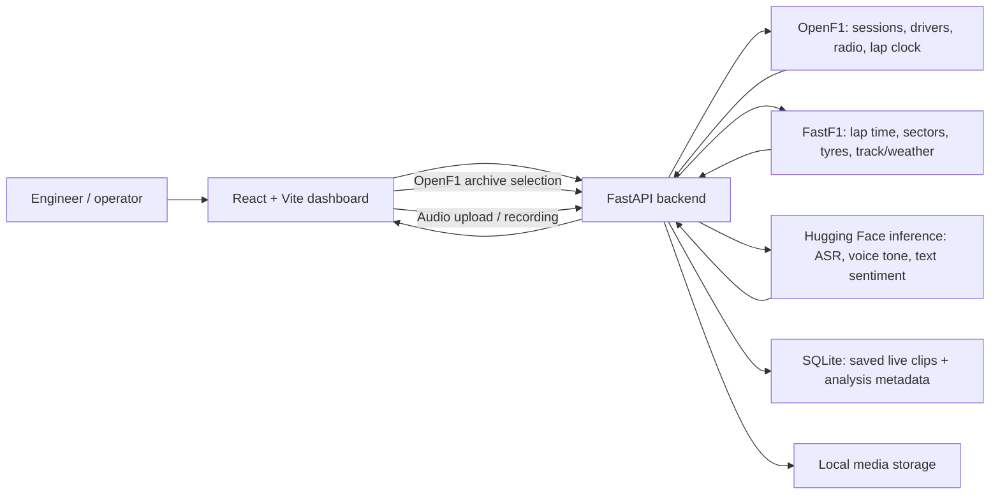

# RADIO TALK: The Silent Co-driver

An F1 team-radio review dashboard that brings together radio audio, speech-to-text, mood signals, conservative fatigue-cue screening, and lap-time context.

It is designed to support engineers during a session: select an archived OpenF1 radio or upload a new clip, inspect its transcript and signal confidence, then check the associated lap and race context before acting. It does **not** diagnose a driver or establish that a mood signal caused a pace change.

## What it does

- Plays public team-radio recordings from OpenF1 and maps them to the driver's lap.
- Uploads or records radio audio for transcription and analysis.
- Combines audio-tone and transcript sentiment into an operator-facing mood signal: `frustrated`, `dejected`, `neutral`, or `happy`.
- Falls back transparently to transcript sentiment if radio noise prevents a reliable acoustic tone reading.
- Screens the transcript for explicit tiredness/focus wording (`high`, `watch`, or `no signal`). This is not a medical assessment.
- Plots FastF1 lap times with median delta, rolling pace trend, sectors, tyre data, pit laps, safety-car/VSC status, and available weather context.
- Flags the lap after a concerning radio and distinguishes race-condition explanations from driver-state signals.
- Provides stint summaries, a driver/session comparison, a compact session timeline, a priority queue, and local acknowledgement controls.

## Architecture



### Decision flow

1. A radio is selected or uploaded.
2. Audio validation checks size, format, and duration.
3. Voice-tone analysis and transcription run independently; transcript sentiment runs once text exists.
4. The app produces an explainable mood signal and a transcript-only fatigue cue screen.
5. When race data is available, the radio is matched to its lap and compared with the driver's session median and the next lap.
6. Pit, safety-car/VSC, and rain context take precedence over any implied driver-state explanation.

## Quick start with Docker

### Prerequisites

- Docker Desktop (or Docker Engine with Compose)
- A Hugging Face access token if you want transcription and model analysis

### 1. Configure your token

Copy the example configuration:

```bash
cp .env.example .env
```

Edit `.env` and set a newly created token:

```dotenv
HF_TOKEN=hf_your_new_token_here
```

Create the token at [Hugging Face settings](https://huggingface.co/settings/tokens). Do not commit `.env`, paste a token in frontend code, or share it in screenshots. `HF_API_KEY` is also accepted for existing deployments, but `HF_TOKEN` is preferred.

### 2. Start the stack

```bash
docker compose up --build
```

Open:

- Dashboard: [http://localhost](http://localhost)
- API documentation: [http://localhost:8000/docs](http://localhost:8000/docs)
- Health check: [http://localhost:8000/health](http://localhost:8000/health)

To run in the background:

```bash
docker compose up -d --build
```

To stop it:

```bash
docker compose down
```

Saved live uploads and the FastF1 cache are stored under `backend/app/data/` and remain available across container restarts because that directory is mounted by Compose.

## Local development without Docker

Use two terminals.

### Backend

```bash
cd backend
python3 -m venv .venv
source .venv/bin/activate
pip install -r requirements.txt
uvicorn app.main:app --reload --host 0.0.0.0 --port 8000
```

For this direct backend command, set `HF_TOKEN` in `backend/.env` or export it in the shell before starting. The repository-root `.env` is read by Docker Compose, not automatically by a backend process started from `backend/`.

### Frontend

```bash
cd frontend
npm ci
npm run dev
```

The development frontend defaults to `http://127.0.0.1:8000`. Override it in `frontend/.env` if needed:

```dotenv
VITE_API_BASE_URL=http://127.0.0.1:8000
```

## Configuration

All settings are optional unless noted.

| Variable | Default | Purpose |
| --- | --- | --- |
| `HF_TOKEN` | — | Required for Hugging Face transcription and analysis. Preferred token name. |
| `HF_API_KEY` | — | Backwards-compatible alternative to `HF_TOKEN`. |
| `HF_ASR_MODEL_ID` | `openai/whisper-large-v3` | Hugging Face automatic speech-recognition model. |
| `HF_AUDIO_MODEL_ID` | `ehcalabres/wav2vec2-lg-xlsr-en-speech-emotion-recognition` | Audio emotion model. |
| `HF_TEXT_MODEL_ID` | `j-hartmann/emotion-english-distilroberta-base` | Transcript sentiment model. |
| `HF_ASR_TIMEOUT_SECONDS` | `60` | Timeout for transcription calls. |
| `HF_ASR_MAX_RETRIES` | `2` | Number of ASR retry attempts. |
| `HF_INFERENCE_TIMEOUT_SECONDS` | `30` | Timeout for voice-tone and text-sentiment calls. |
| `AUDIO_DENOISE_ENABLED` | `true` | Enables the ffmpeg noisy-radio preparation step for voice-tone analysis. |
| `MAX_AUDIO_UPLOAD_BYTES` | `20971520` | Maximum upload size (20 MB). |
| `MAX_AUDIO_DURATION_SECONDS` | `120` | Maximum audio duration in seconds. |
| `OPENF1_API_BASE_URL` | `https://api.openf1.org/v1` | Override for OpenF1-compatible environments. |
| `DATA_FILE_PATH` | `../final_labeled_dataset.csv` | Optional labelled clip dataset for the legacy/archive clip library. |
| `VITE_API_BASE_URL` | `http://127.0.0.1:8000` | API address compiled into the frontend. |

## API

Interactive OpenAPI documentation is available at `/docs` while the backend is running. The main endpoints are below.

| Method | Endpoint | Purpose |
| --- | --- | --- |
| `GET` | `/health` | Basic backend liveness check. |
| `GET` | `/api/clips` | List saved live and optional labelled archive clips. Optional filters: `driver`, `gp`, `mood`. |
| `GET` | `/api/clips/{clip_id}` | Retrieve one saved/archive clip. |
| `POST` | `/api/analyze` | Upload and analyze a radio clip. Uses `multipart/form-data`. |
| `POST` | `/api/analyze/openf1` | Download and analyze a selected OpenF1 radio. |
| `GET` | `/api/laps` | Return FastF1 lap points plus performance summaries. Required: `gp`, `session`, `driver`; optional: `year`. |
| `GET` | `/api/openf1/sessions` | List a season's OpenF1 sessions. Required: `year`. |
| `GET` | `/api/openf1/drivers` | List drivers for an OpenF1 session. Required: `session_key`. |
| `GET` | `/api/openf1/radio` | List playable team radio. Required: `session_key`; optional: `driver_number`. |
| `GET` | `/api/openf1/radio-context` | Resolve a radio's driver/session context and best-effort lap mapping. |

### Analyze an uploaded radio

```bash
curl -X POST http://localhost:8000/api/analyze \
  -F "audio=@./team-radio.mp3" \
  -F "driver_code=VER" \
  -F "driver_name=Max Verstappen" \
  -F "gp=Monaco Grand Prix" \
  -F "session=Race" \
  -F "lap_number=42"
```

You may send a known transcript as `transcript` to skip ASR, or `retry_services` with a comma-separated subset of `transcription`, `audio`, and `text` to retry only failed providers. Successful original uploads are saved as live clips; retries do not create duplicates.

### Get telemetry and performance insight

```bash
curl "http://localhost:8000/api/laps?gp=Monaco%20Grand%20Prix&session=Race&driver=VER&year=2026"
```

The response includes lap time, delta from median, rolling trend, sectors and available race context. `performance` includes fastest/average/slowest pace, flagged follow-up laps, stint summaries, and a timeline. It describes associations only—never causation.

For full response shapes, see [shared/schema.md](shared/schema.md).

## Data sources and attribution

| Source | Used for | Notes |
| --- | --- | --- |
| [OpenF1](https://openf1.org/) | Sessions, driver identities, public team-radio records, radio timestamps, lap-clock mapping | The app uses OpenF1 IDs/date fields to retrieve and map selected radios. Availability depends on OpenF1's public coverage. |
| [FastF1](https://docs.fastf1.dev/) | Lap times, sectors, tyres, pit laps, track status, weather | Used for plotted performance context. Results depend on session availability and cache state. |
| [Hugging Face](https://huggingface.co/docs) | Transcription, voice tone, transcript sentiment | Requires an operator-provided token. Provider failures are shown per service rather than failing the complete radio review. |
| Optional labelled CSV | Legacy/archive clip library and pre-associated lap labels | Expected fields are documented in `handoff_brief.md`; this file is optional for OpenF1 and live-upload workflows. |

## Safety and interpretation

- Mood is a model-assisted review signal based on voice and/or transcript, not a statement of fact about a driver.
- Fatigue is limited to explicit tiredness or focus wording found in a transcript. It is **not medical advice or a diagnosis**.
- A slower follow-up lap does not prove the radio state caused the pace change. The dashboard highlights pit laps, safety-car/VSC, and rain so these conditions can be considered first.
- Radio is naturally noisy. If acoustic tone cannot be isolated, the UI labels the result as a transcript-derived estimate instead of pretending that it is a voice measurement.
- Engineers should validate all alerts against radio context, timing, race control, and team procedure.

## Testing and quality checks

Run frontend checks:

```bash
cd frontend
npm run build
npm test -- --run
npm run lint
```

Run backend tests in the production-like container:

```bash
docker compose build backend
docker compose run --rm backend python -m unittest discover -s tests -v
```

The test suite covers upload validation, service-failure fallbacks, OpenF1 lap mapping, FastF1 context enrichment, live clip persistence, fatigue cue screening, and performance-insight calculations.

## Deployment notes

The supplied Compose configuration is appropriate for a local demo. Before deploying publicly:

- Set a fixed `VITE_API_BASE_URL` for the deployed API **at build time**.
- Serve frontend and API through HTTPS and restrict CORS from `*` to your frontend origin.
- Use a managed secret store for `HF_TOKEN`; never place it in the image or client bundle.
- Persist `backend/app/data/` to durable storage if live clips should survive host replacement.
- Add authentication, rate limiting, provider health monitoring, and a production database before a multi-user deployment.
- Review OpenF1, FastF1, Formula 1 media, and Hugging Face terms before distributing recordings or model outputs.

## Project layout

```text
backend/
  app/
    routers/        API endpoints
    services/       OpenF1, FastF1, audio, transcription, insight logic
    models/         Pydantic response contracts
    data/           FastF1 cache, live uploads, SQLite live-clip store
  tests/            Backend unit tests
frontend/
  src/components/   Radio archive, uploader, chart, queue, audio UI
  src/pages/        Dashboard composition
shared/schema.md    Frontend/backend contract
docker-compose.yml  Local demo stack
```

## License and data responsibility

No licence has been declared for this repository. Treat all source data and audio as subject to their respective providers' terms. Do not use this project to make health, employment, or safety decisions without appropriate human oversight.
